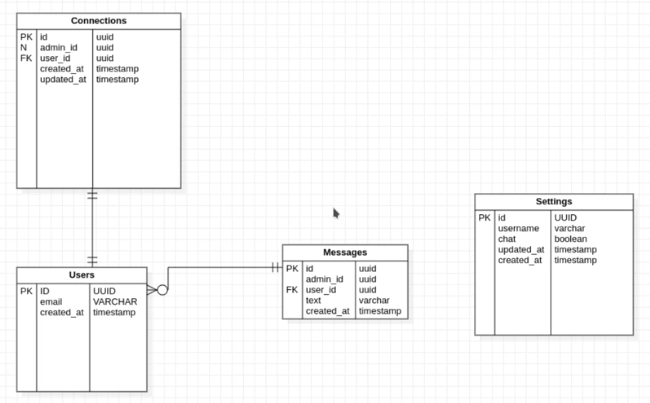

# Projeto Chat - Node.js 

## Instalação das Dependências

* Iniciando o projeto:  
`npm init -y`

* TypeScript como dependência de desenvolvimento:  
`npm install typescript -D`

* Ferramenta para execução em desenvolvimento:   
`npm install ts-node-dev -D`

* Express:  
`npm install express`

* Tipagens do Express:  
`npm install @types/express -D`

* Tipagens do Node (importante!):  
`npm install @types/node -D`

## Configurando o TypeScript

* Criando o `tsconfig.json` na raiz do projeto:  
`npx tsc --init`

* Edite o `tsconfig.json` gerado:  
```
{
  "compilerOptions": {
    // Versão do JavaScript para a qual o código será compilado
    "target": "ES2020",
    
    // Sistema de módulos: CommonJS (padrão Node.js)
    "module": "commonjs",
    
    // Pasta de saída para os arquivos JavaScript compilados
    "outDir": "./dist",
    
    // Pasta raiz dos arquivos TypeScript fonte
    "rootDir": "./src",
    
    // Ativa todas as verificações rigorosas de tipo
    "strict": true,
    
    // Habilita interoperabilidade entre módulos ES e CommonJS
    "esModuleInterop": true,
    
    // Ignora verificações de tipos em arquivos de declaração (.d.ts)
    "skipLibCheck": true,
    
    // Força nomes de arquivos com casing consistente em imports
    "forceConsistentCasingInFileNames": true
  },

  // INCLUDE: Especifica quais pastas/arquivos o TypeScript deve compilar
  // "src/**/*" = todos os arquivos dentro da pasta src e subpastas
  "include": ["src/**/*"],
  
  // EXCLUDE: Evita que o TypeScript compile dependências e arquivos já compilados
  // "node_modules" = bibliotecas de terceiros
  // "dist" = arquivos JavaScript já compilados
  "exclude": ["node_modules", "dist"]
}
```
## Configurando o package.json

* Na chave "scripts" adicione logo abaixo:
```
"dev": "ts-node-dev --respawn --transpile-only src/server.ts",
"build": "tsc",
"start": "node dist/server.js"
```

## Rodando o projeto em modo desenvolvedor

* Temos três comando disponíveis: *dev, build e start*  
`npm run dev`

## Ferramenta de requisições para API
* Insomnia

## Instalação do ORM TypeORM com Sqlite

`npm install typeorm reflect-metadata sqlite3`

* Comando para migrations:  
* Gerar migration  
`npm run migration:generate -- src/database/migrations/NomeMigration`

* Executar migrations  
`npm run migration:run`

* Reverter migration  
`npm run migration:revert`

* Criar migration manual  
`npm run migration:create -- src/database/migrations/NomeMigration`

* Diagrama de Classes  


## Tecnologias Utilizadas

* NodeJs  
* Typescript  
* ORM - TypeORM  
* SQlite  